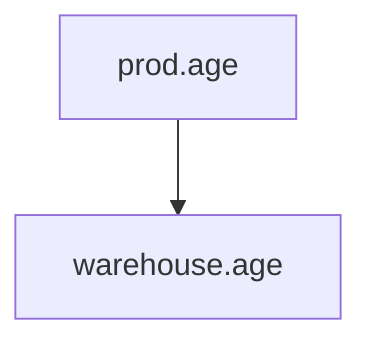

# grai-actions


# Testing

Tests rely upon [act](https://github.com/nektos/act) for local validation

```
 act -s GITHUB_TOKEN="test"
 ```

<details><summary><h4>Temp</h4></summary><p><br/>test</p></details>


<details><summary>CLICK ME</summary>
<p>

#### We can hide anything, even code!

```ruby
   puts "Hello World"
```

</p>
</details>


<details><summary>❌ Test Results</summary><p><br/><h4>Temp</h4></p></details>

<details><summary>Test Results</summary><p><br/>
<details><summary>data/prod.age</summary><p><br/>


</p></details>
</p></details>


    

<details><summary><h4> data/prod.age </h4</summary>
<p>


<h4> Failing Tests </h4

| Dependency | Test | Message |
| --- | --- | --- |
| data/warehouse.age | data type | expected float |
    
    

</p>
</details>
